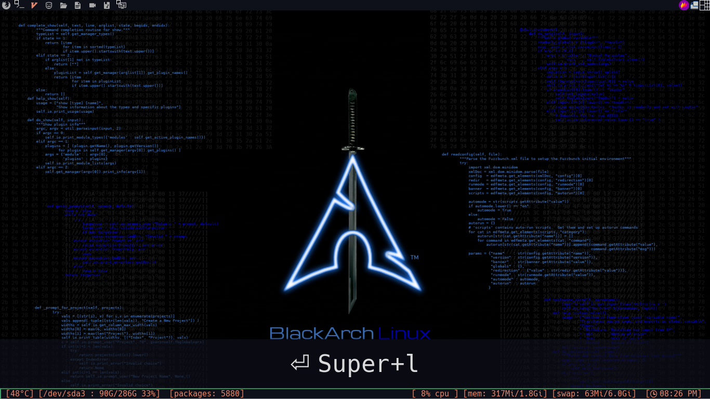
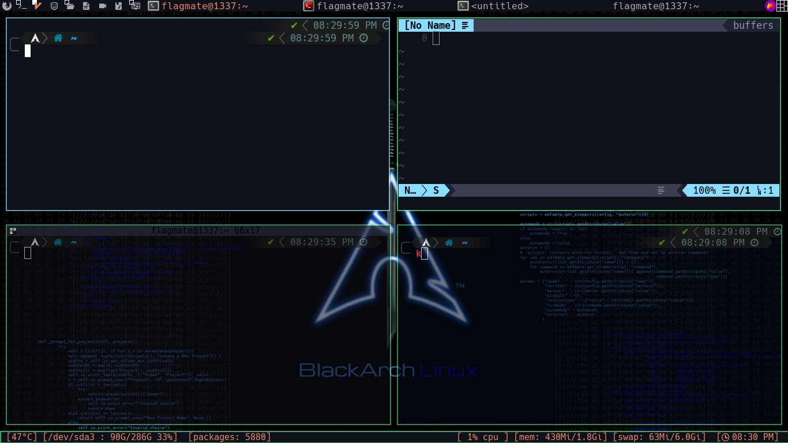

# my black arch config
## font 
* Hack Nerd Font
* Any Nerd Font can work

# install
 * Copy everything to you $HOME folder 
 * on ~/.config/mutt/muttrc and put you email in order for it to work
 * install all the apps awesome wm polybar zsh zsh plugins.....
# screenshots
-----------------------------------------------

  |mod4+shift+w or right click menu|        desktop          |screenkey for creators    |
  |:------------------------------:|:-----------------------:|:------------------------:|
  |       || |

   |        layout1          |        layout2          |        layout3          |
   |:-----------------------:|:-----------------------:|:-----------------------:|
   ||||
   

  |          Run menu                                   |
  |:---------------------------------------------------:|
  |   |
 
# todo 
-----------------------------------------------
- [X] awesome window manager

- [X] polybar

- [X] screenshots

- [ ] make a script to auto installation

# installation script
================================================

- [X] everything depends on user choices

- [X] update packages

- [X] install blackarch metapackage (hacking tools fot blackarch)
        `insert n if you have regular arch distro without blackarch`

## install
- [X] zsh

- [X] vim

- [X] neovim

- [X] vifm

- [X] neomutt

- [X] termintator

- [X] termite

- [X] xfce terminal

- [X] neoftech

- [X]  polybar

- [X] St terminal (my build)

## config

- [X]  awesome config

- [ ]  polybar confign 

- [ ] zsh

- [X] bash

- [X] Vifm

- [X] vim

- [X] neovim

- [X] neomutt

- [ ] termintator

- [ ] termite

- [ ] xfce4 terminal

- [ ] neoftech