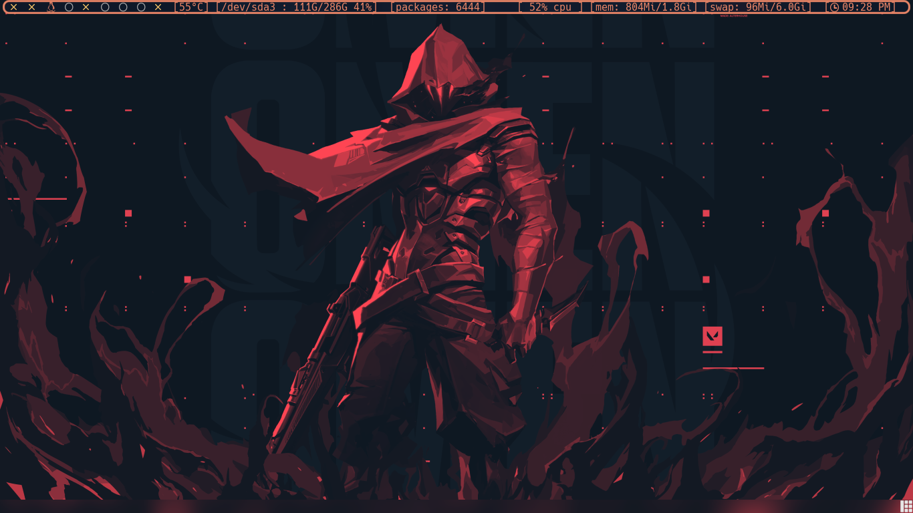
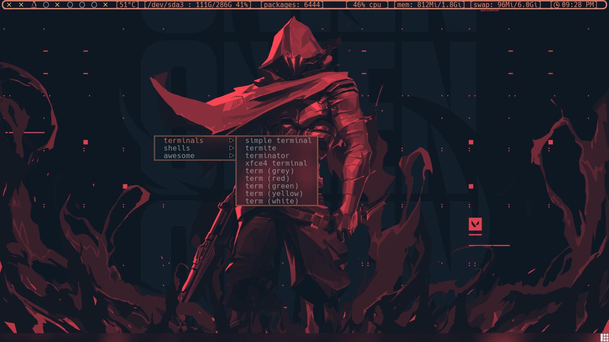
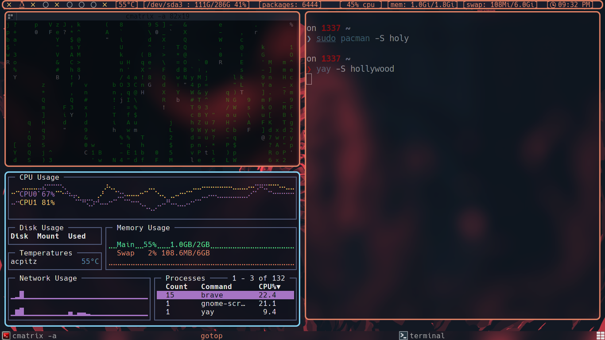
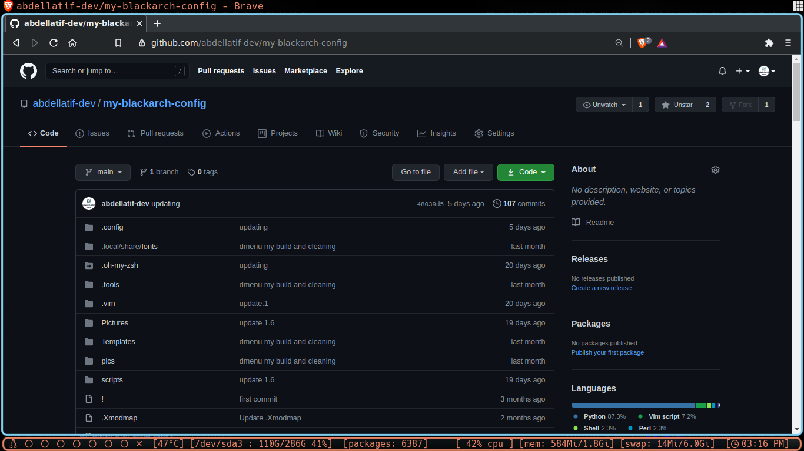
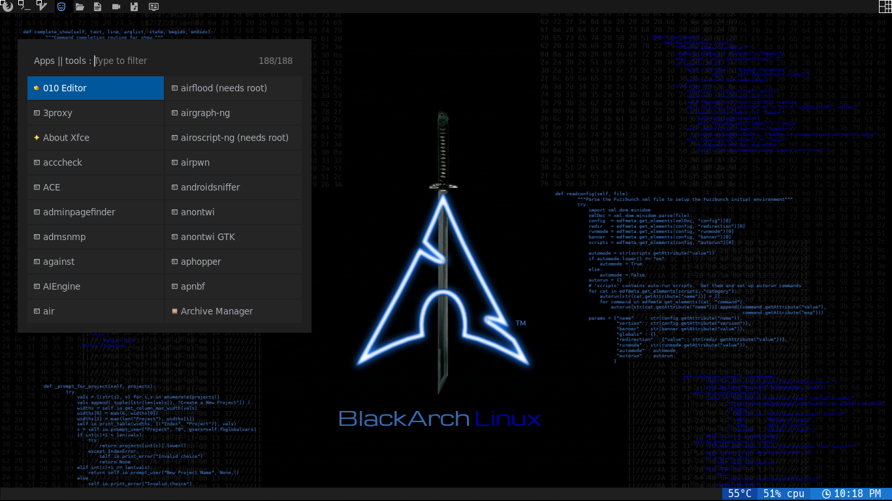
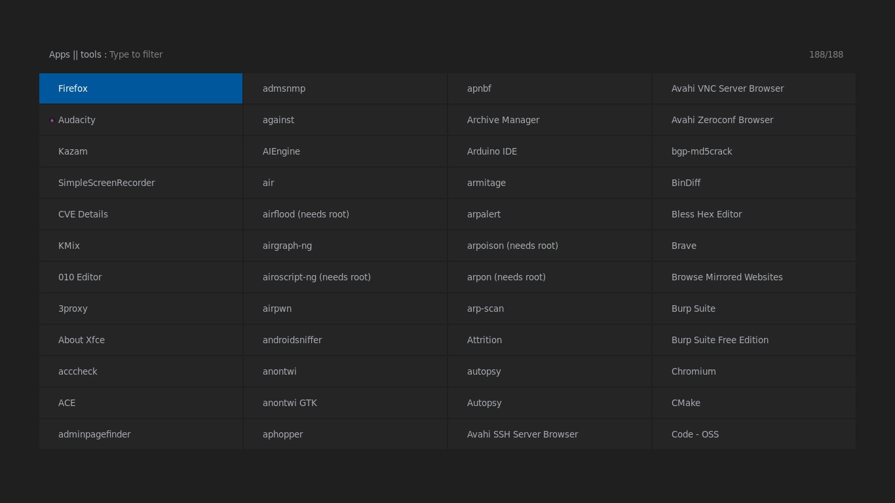

# my black arch config

# screenshots
-----------------------------------------------

* desktop
    

* mod4+shift+w or right click menu
    
    

* layouts
    

* run menu
    
    

# coming soon
-----------------------------------------------
- [ ] update polybar

- [ ] update screenshots

- [ ] make a script to auto installation
