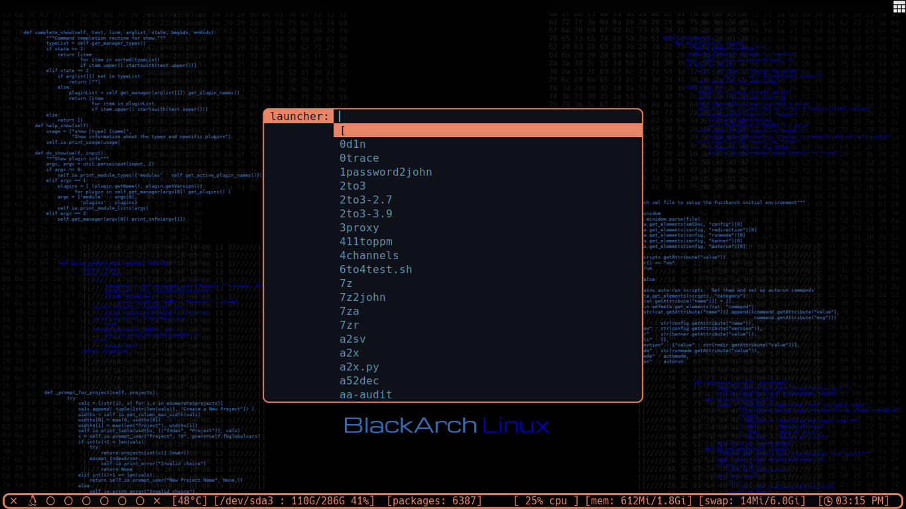

# my black arch config
## font 
* Hack Nerd Font
* Any Nerd Font can work

# install
 * Copy everything to you $HOME folder 
 * on ~/.config/mutt/muttrc and put you email in order for it to work
 * install all the apps awesome wm polybar zsh zsh plugins.....
# screenshots
-----------------------------------------------

  | desktop                   | mod4+shift+w or right click menu | screenkey for creators    |
  |:-------------------------:|:--------------------------------:|:-------------------------:|
  |  |         |  |
  | layout                    | compton (picom)                  | emacs-config              |
  |  |         |  |
  | Run menu                  | Run menu fullscreen              | dmenu-abdellatif          |
  |  |         |  |
 
# todo 
-----------------------------------------------
- [X] awesome window manager

- [X] polybar

- [X] screenshots

- [X] dmenu my costume build

- [x] make a script to auto installation

# installation script
================================================

- [X] everything depends on user choices

- [X] update packages

- [X] install blackarch metapackage (hacking tools fot blackarch)
        `insert n if you have regular arch distro without blackarch`

# script

* install

  - [X] zsh

  - [X] vim

  - [X] neovim

  - [X] vifm

  - [X] neomutt

  - [X] termintator

  - [X] termite

  - [X] xfce terminal

  - [X] neoftech

  - [X]  polybar

  - [X] St terminal (my build)

  - [X] rofi 
  
  - [x] lxappearance

  - [X] breeze (theme/icons)

  - [X] thunar

  - [X] keyscreen

  - [X] xarchiver

  - [X] bat

  - [X] brave 
  
  - [X] dmenu my build

  - [X] obs or simplescreenrecorder
  
  - [x] emacs
