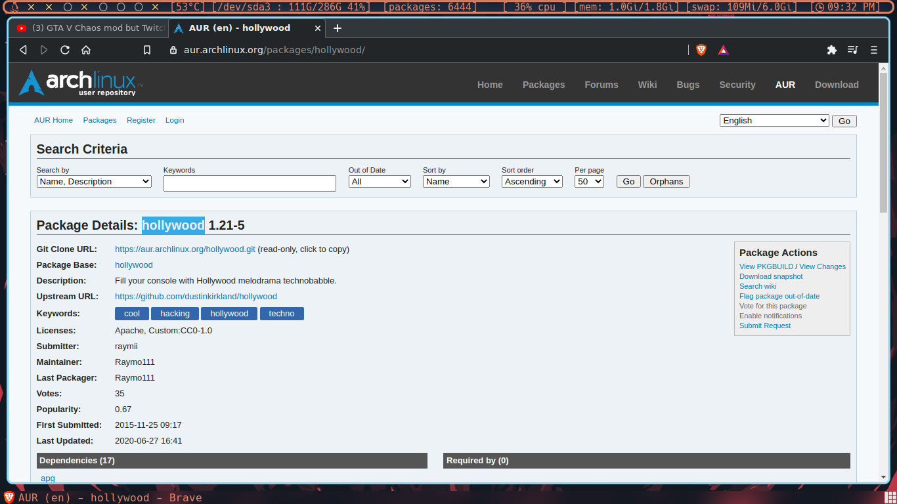
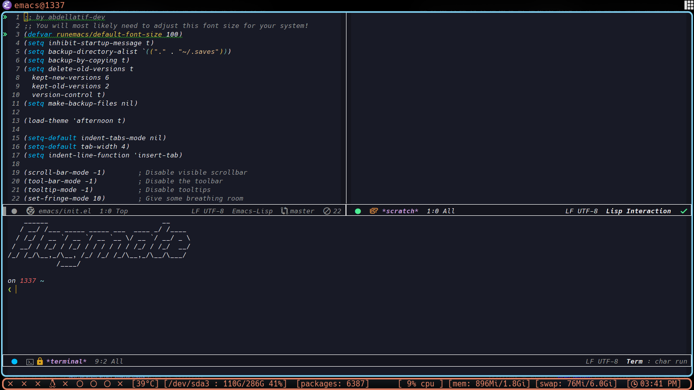
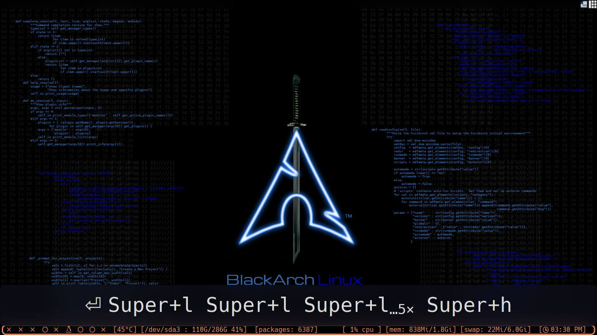

# my black arch config
## font 
* Hack Nerd Font
* Any Nerd Font can work

# screenshots
-----------------------------------------------

* desktop
    

* mod4+shift+w or right click menu
    

* layouts
    
    
    

  |          Run menu                                   | screenkey for creators  |
  |:---------------------------------------------------:|:-----------------------:|
  |   ||

  | screenkey for creators  |
  |:-----------------------:|
  ||
 
# todo 
-----------------------------------------------
- [X] awesome window manager

- [X] polybar

- [X] screenshots

- [ ] make a script to auto installation

# installation script
================================================

- [X] everything depends on user choices

- [X] update packages

- [X] install blackarch metapackage (hacking tools fot blackarch)
        `insert n if you have regular arch distro without blackarch`

- [ ] ohmyzsh

- [ ] zsh

- [ ] bash

- [ ] vim

- [ ] neovim

- [ ] Vifm

- [ ] neomutt

- [ ] termintator

- [ ] termite

- [ ] xfce terminal

- [ ] St terminal (my build)

- [ ]  awesome config

- [ ]  polybar

