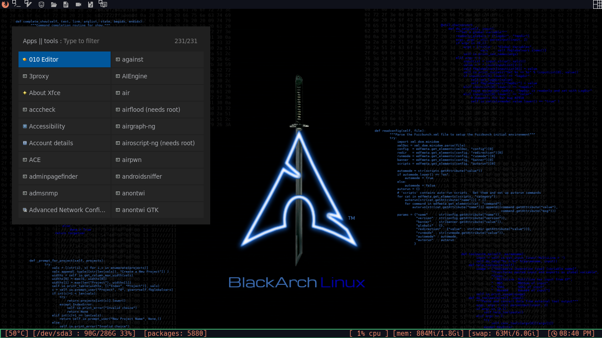
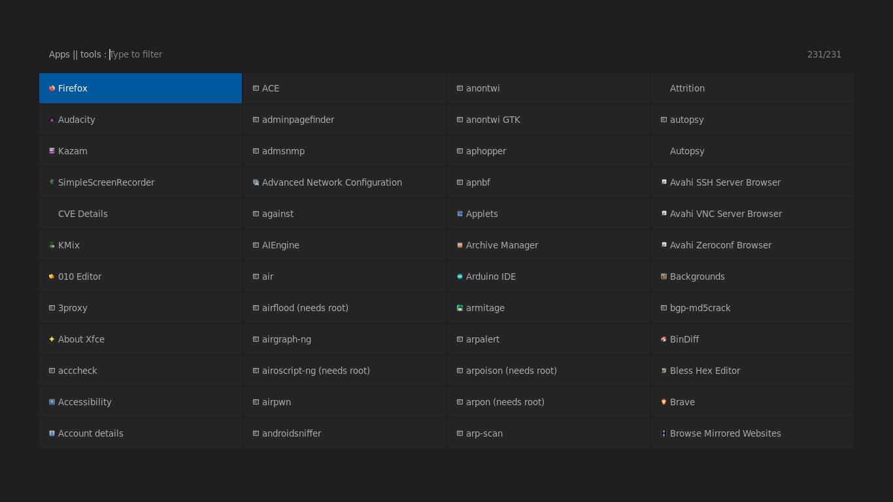

# my black arch config

# screenshots
-----------------------------------------------

* desktop
    

* mod4+shift+w or right click menu
    

* layouts
    
    
    

* run menu
    
    

* screenkey
    

# todo 
-----------------------------------------------
- [ ] update polybar

- [ ] update screenshots

- [ ] make a script to auto installation

